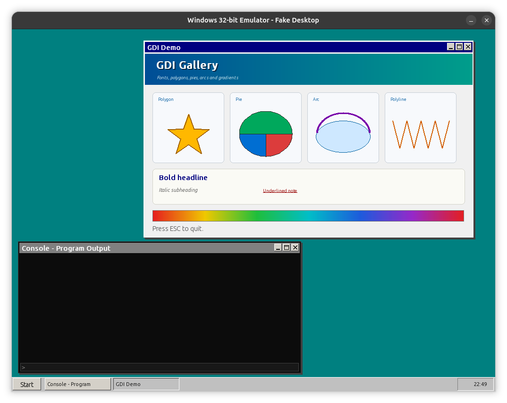

# winexe32emu

32-bit Windows EXE emulator in Python. Written with GitHub Copilot and Claude AI.



## Installation

```bash
pip install -r requirements.txt
```

## Usage

Put EXE files or compile examples in the c_drive/ folder. After that, run:

```bash
python3 winexe32emu.py gdi_demo.exe
```

Use `-h` parameter for command-line help.

## Folder Structure

- `c_drive/` - Put your EXE files here (emulation path)
- `examples/` - Example C source codes
- `compile-examples.sh` - Script to compile examples
- `winexe32emu.py` - The main script

## Features

- PE file loading and analysis
- x86 CPU emulation (Unicorn)
- Fake Windows desktop with Pygame
- Basic Win32 API support (user32, kernel32, gdi32, msvcrt)

## Versioning

- First version is 0.0.1, every version is bumped to 0.0.5, 0.0.10, 0.0.15 etc.

## Disclaimer

This project is not endorsed by, affiliated with, or sponsored by Microsoft Corporation in any way. Windows, Win32, and related trademarks are the property of Microsoft Corporation. This is an independent, educational emulation project.

## Copyright and License

Copyright 2025-2026 Erdem Ersoy (eersoy93)

Licensed under the Apache License, Version 2.0 (the "License");
you may not use this file except in compliance with the License.
You may obtain a copy of the License at

    http://www.apache.org/licenses/LICENSE-2.0

Unless required by applicable law or agreed to in writing, software
distributed under the License is distributed on an "AS IS" BASIS,
WITHOUT WARRANTIES OR CONDITIONS OF ANY KIND, either express or implied.
See the License for the specific language governing permissions and
limitations under the License.
