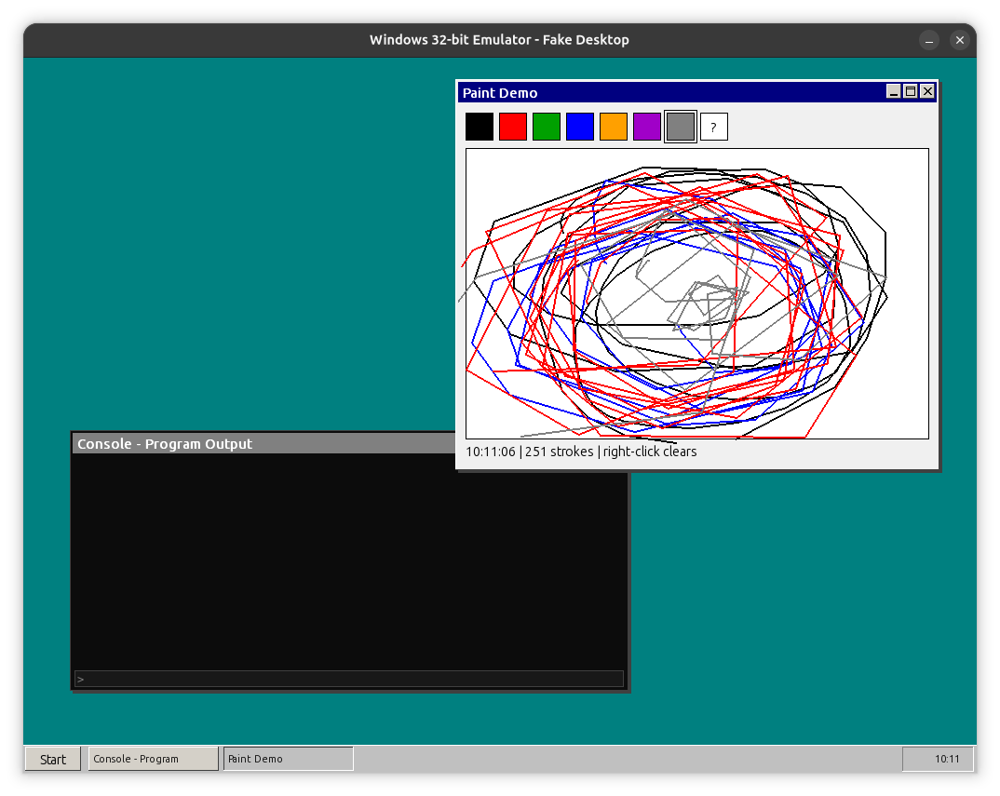

# winexe32emu.py

32-bit Windows EXE emulator in Python. Written with GitHub Copilot and Claude AI.



## Installation

```bash
pip install -r requirements.txt
```

## Usage

```bash
# Put EXE files in the c_drive/ folder
python winexe32emu.py window_demo.exe

# Calculator / form demo (EDIT controls, GetDlgItemInt, qsort, strtol)
python winexe32emu.py calc_demo.exe -n 0

# With maximum instruction count
python winexe32emu.py window_demo.exe -n 10000

# Unlimited instructions (recommended for games)
python winexe32emu.py ball_demo.exe -n 0

# Set memory amount (MiB)
python winexe32emu.py console_demo.exe -m 256

# Run without GUI
python winexe32emu.py console_demo.exe --no-gui

# Also works with full path
python winexe32emu.py /path/to/file.exe
```

## Folder Structure

- `c_drive/` - Put your EXE files here (default search path)
- `examples/` - Example C source codes
- `compile-examples.sh` - Script to compile examples

## Features

- PE file loading and analysis
- x86 CPU emulation (Unicorn)
- Fake Windows desktop with Pygame
- Basic Win32 API support (user32, kernel32, gdi32, msvcrt)
- Interactive controls: buttons, edit boxes, list/combo boxes, scrollbars, menus
- Form helpers: `GetDlgItemInt` / `SetDlgItemInt`, `GetWindowLong` / `SetWindowLong`
- C runtime helpers: string (`strchr`, `strstr`, `strtol`, `strncmp`, ...),
  character classification (`isdigit`, `toupper`, ...), `qsort` / `bsearch`,
  and a basic `sscanf`
- Console and GUI application support

## Disclaimer

This project is not endorsed by, affiliated with, or sponsored by Microsoft Corporation in any way. Windows, Win32, and related trademarks are the property of Microsoft Corporation. This is an independent, educational emulation project.

## Copyright and License

Copyright 2025-2026 Erdem Ersoy (eersoy93)

Licensed under the Apache License, Version 2.0 (the "License");
you may not use this file except in compliance with the License.
You may obtain a copy of the License at

    http://www.apache.org/licenses/LICENSE-2.0

Unless required by applicable law or agreed to in writing, software
distributed under the License is distributed on an "AS IS" BASIS,
WITHOUT WARRANTIES OR CONDITIONS OF ANY KIND, either express or implied.
See the License for the specific language governing permissions and
limitations under the License.
